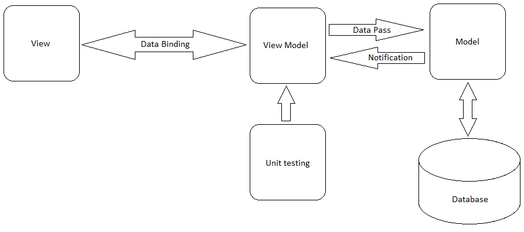

# Architecture

## Architecture Model

The architecture model adopted was XXX (MVC, MVP, MVVM, ...)

Explain the logic between layers

* A
* B
* C
* D

<figure><figcaption></figcaption></figure>

Explain layer abstractions (i.e. each layer and "explode")

 

<figure><figcaption></figcaption></figure>

## Logical View

### Class Diagram

### Database
